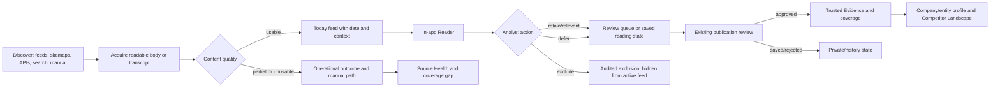

# Berry Intelligence OS — Product Experience Roadmap V1

**Planning checkpoint:** `031c9b6a80bd72ce3f271933d8a1ea302decb077`
**Base:** `origin/integration/competitor-intelligence-v1`
**Prepared:** 2026-09-15
**Status:** documentation-only product plan; no application implementation is included.

## Executive direction

Berry Intelligence OS has the foundations of a trustworthy competitive-intelligence product, but its strongest capabilities are not yet composed into one daily habit. The next product slice should make the existing `/today` and shared Reader the beginning of a deliberate loop: discover, acquire, assess quality, read in context, make a reversible review decision, and then move to the relevant company, variety, source-health, or competitor-landscape view.

The order matters. The 33-entry canonical roster and honest acquisition states are useful foundations, but the integration checkpoint reports 25 roster entries at representation-only maturity, eight configured-but-never-run entries, zero linked successful discovery runs, zero readable linked acquisitions, and zero current usable published coverage in its isolated runtime. Source activation therefore precedes meaningful source-performance scoring. A daily feed can be designed now, but it must not imply market absence when captured coverage is thin.

The recommended first production slice is **Daily Reading Loop V1**: a production-grade feed projection over existing trusted/pending records, the existing shared in-app Reader, persisted analyst reading state, and explicit navigation into existing review and profile surfaces. It should not introduce a new trust object, a new source adapter, or an AI narrative layer.

## Answers to the seven planning questions

1. **Use of collection mechanisms:** The system has the right separation of configured, runnable, discovered, body-readable, relevant, current, and trusted states. The source-strategy branch covers all 33 roster rows, identifies 21 existing-adapter candidates across 19 companies, and recommends a 12-entry first activation wave. The immediate gap is controlled activation and measurement, not speculative adapter expansion. APIs and search are discovery/gap-filling inputs; direct feeds, sitemaps, official pages, trade sources, registries, university sources, and transcripts each need an evidence role and the existing content-honesty gate.
2. **Today as a Feedly-style experience:** Turn `/today` into a saved-view-capable reading workspace with a left navigation rail, a central visual feed, and an optional Reader pane. Preserve the current publication-date contract and add explicit 0–30, 31–60, 61–90, historical, and unknown-date groups. Relevance and coverage context should be visible without pretending that a ranking is a truth score.
3. **In-app reading:** Reuse `/intelligence/{id}`, `/api/intelligence/{id}/reader`, `#v2ReaderOffcanvas`, and `_reader_panel.html`. Open readable article bodies and transcripts in a drawer or split pane; keep “View original source” secondary. Partial, blocked, consent, navigation-only, and empty captures must be visibly limited and never receive fabricated text.
4. **Thumbs feedback:** Add a fast review affordance, but map it to a durable analyst decision with explicit semantics. “Up” means a selected action such as relevant/retain-for-review, not automatic trust. “Down” records exclusion reason and removes the item from the analyst’s active feed projection without deleting provenance. Existing publication approval remains the only route to trusted Evidence.
5. **One visual language:** The repository currently contains a stakeholder shell (`base_stakeholder.html` + `stakeholder.css`) and an analyst V2 shell (`base.html` + `v2.css`), plus older surfaces. Adopt the V2 shell’s navigation, Reader, status marks, spacing, and focus conventions as shared primitives, while allowing the existing Today stakeholder page to migrate incrementally.
6. **Credible demonstration today:** Demonstrate the integrated `/competitors` surface, 33/33 canonical roster, filtered landscape and company drill-down, honest California Giant gaps, Ozblu as a brand, UC Davis as a breeding program, Source Health’s separate discovery/body states, and the real static-build/browser artifacts. Do not present source activation, current coverage, Python 3.14 validation, or a production thumbs workflow as complete.
7. **Next order:** First validate/merge the integrated foundation in the canonical Linux/CI environment; then activate the approved source wave; then ship the Daily Reading Loop and Reader; then add trust feedback; then consolidate visual language and personalization; finally optimize source allocation from measured outcomes.

## Current product contract

The following are non-negotiable constraints for all roadmap phases:

- A captured date is not a publication date. A recently captured old article belongs in historical context, not a current-news band.
- Representation, discovery success, readable acquisition, relevance, current coverage, and trusted publication are separate facts.
- Unusable captures — consent pages, bot walls, empty pages, navigation shells, and other content rejected by `reader_content()` — do not enter Today, reports, company coverage, or trusted Evidence.
- Pending review is not trusted. A Signal, Assessment, Fact, Evidence item, acquisition outcome, and educational item retain distinct classes.
- A source-health bucket is operational health, not competitive recall or market activity.
- A derived review decision never silently mutates Evidence, Signal, Assessment, Source, or entity identity.
- Existing routes and services are preferred over a parallel repository or duplicate workflow.
- No competitive strength, threat, momentum, innovation, or source-quality score should be introduced as a single blended number.

## North-star daily workflow

Today answers “what should I read now?” The Reader answers “what does this source actually say?” Review controls answer “what should stay in the analyst’s working set or become trusted?” Source Health answers “can the system obtain and read it?” Company/entity profiles and `/competitors` answer “where does it sit in the monitored universe?” These are linked views, not competing data stores.

## Current-state matrix

The detailed evidence table is maintained in [CURRENT-STATE-AUDIT.md](../../artifacts/product-experience-roadmap-v1/CURRENT-STATE-AUDIT.md). The high-level position is:

| Capability | Current status | Truthful boundary |
|---|---|---|
| Competitor landscape | Implemented on an unmerged branch | 33/33 canonical rows and filters are demonstrated on the integration checkpoint; not deployed from this checkpoint. |
| Canonical roster | Implemented on an unmerged branch | 33/33 resolve; maturity is mostly representation, not active coverage. |
| Company/genetics relationships | Implemented on an unmerged branch | Pending/disputed relationships remain visibly pending; do not flatten breeder, owner, licensee, and marketer roles. |
| Source Health | Production and deployed foundations, extended on unmerged integration | Discovery and article-body outcomes are separate; activation is not complete. |
| Acquisition outcomes | Implemented on an unmerged branch / prior repair foundations | Durable outcomes include readable, blocked, consent, empty, shell, parser, network, and manual states. |
| Today/newsfeed | Production and deployed, limited editorial surface | Publication-date-honest, filtered, paginated, but not yet a personalized three-pane reading workspace. |
| In-app Reader | Production and deployed | Shared Reader/offcanvas and full reader exist; no universal visual feed integration yet. |
| Thumbs-up/down review | Absent | Existing Keep/Promote/Dismiss actions must not be relabeled as thumbs semantics without a state model. |
| Review queues | Production and deployed | Publication, Source Fidelity, Atomic, testing, and other queues exist; actions retain trust boundaries. |
| Source activation | Planned / in progress on Sol’s branch | 12 first-wave candidates need human sign-off and separate operational runs. |
| Images/visual news cards | Implemented in limited surfaces | Image URLs are safety-filtered where used; no consistent publisher/competitor visual-card system exists. |
| Query/filter persistence | Implemented on selected surfaces | Landscape and existing routes preserve query state; Today needs saved-view persistence. |
| Mobile behavior | Validated on unmerged landscape integration | Today/Reader mobile composition needs a dedicated acceptance pass. |
| Unified navigation/design | Implemented as competing shells | Stakeholder and V2 shells both work; migration is planned, not a rewrite. |
| Report/evidence promotion | Production and deployed | Publication review promotes to trusted Evidence; report handoffs remain review-first. |
| Read/unread/saved behavior | Partial | Brief/read state and saved packs exist, but Today needs durable per-analyst reading state and saved views. |

## Product experience: Today V1

### Layout

- **Left rail:** berry context, Today, saved views, reading queue, review, Source Health, companies, varieties, and Competitors. Counts are action counts, not confidence scores.
- **Center feed:** visual cards grouped by the selected recency window. The lead card is reserved for high-priority/current material; the rest use a comfortable or compact density toggle.
- **Right Reader:** optional desktop drawer/split pane using the shared Reader. Closing it returns focus to the originating card and preserves scroll position, filters, sort, and page.
- **Mobile:** feed first; Reader becomes a full-height route or offcanvas. Filters collapse into a labeled control. Sticky action bar remains reachable without hiding date and quality state.

### Card contract

Every card should show, in a stable hierarchy:

1. publisher/source identity and source class;
2. headline and meaningful image or safe publisher/competitor identity treatment;
3. publication date, capture date, and date basis when relevant;
4. company/entity, berry, region, topic, and stored tier context;
5. a short recorded “what changed” field when one exists;
6. a short recorded “why it matters” field when one exists, otherwise explicit absence;
7. trust/review/content-quality marks kept distinct;
8. read/unread and saved/starred state;
9. actions: open Reader, save, review, and secondary original-source link.

Do not generate “what changed” or “why it matters” from a title alone. If the record has no supported interpretation, show “No supported competitive implication has been recorded for this source.”

### Feed behavior

- Default ordering: publication date descending, then stored reading priority. Capture date is a freshness/operations signal, not a recency substitute.
- Recency groups: 0–30 days, 31–60 days, 61–90 days, historical context, and unknown publication date. Unknown dates must never be silently placed in current bands.
- Sorting options: chronological (default) and relevance/context, with the latter exposing its deterministic inputs rather than a mystery score.
- Filters: berry, company/entity, geography, topic, source class, content-quality state, review state, date group, and saved view. Sticky filters must be URL-represented so links remain reproducible.
- Pagination is the safe first implementation. Infinite scroll can follow after scroll-position, keyboard, analytics, and accessibility tests; virtualization is unnecessary until measured item volume requires it.
- Empty states distinguish “no captured stories in this scope,” “no readable stories,” and “no stories after your exclusions.” Each links to archive, Source Health, or filter reset.

### Visual treatment

Use imagery as orientation, not as evidence. Prefer a verified publisher image or a neutral source/competitor identity block; reject unsafe schemes and do not manufacture a stock photograph that implies the article’s subject. A missing image is a designed neutral state, not a broken card.

## In-app article Reader requirements

The shared Reader should become the default open action from Today, `/competitors` drill-downs, Company/Variety Recent Intelligence, review queues, and search results.

| Capture state | Reader behavior | Trust behavior |
|---|---|---|
| Readable article | Render extracted paragraphs, source provenance, publication/capture dates, quality, and review state. | Eligible for analyst review; only existing publication approval can promote it. |
| Partial extraction | Render available text with `BODY PARTIAL` and a warning. | Review requires awareness of incomplete source; never imply full article. |
| Cookie/consent page | Hide contaminated body and show explicit recovery notice. | Not eligible for trusted content or Today article text. |
| Bot wall/access denied | Show outcome category and secondary original-source/manual path. | Unusable and excluded from trusted intelligence. |
| Empty page/navigation shell | Show no fabricated body; expose diagnostic state. | Excluded from trusted content and current coverage. |
| Navigation shell | Preserve app shell and clear Reader state on close. | No source content is asserted. |
| External-only/manual reading | Keep record/source identity and link original source. | Manual review can create a governed Evidence record; clicking alone does not. |
| Unsupported media | Show media type and available metadata; do not pretend it is an article. | Transcript or structured acquisition must satisfy its own gate. |
| Transcript-based content | Render transcript segments when available with media provenance. | Transcript content remains its own source/body state; atomic qualification rules still apply. |

Keyboard: Enter/o opens, Escape closes, j/k moves within the current card set, and focus returns to the triggering control. Mobile closes via an accessible control and restores the feed position. “View original source” is secondary and clearly external.

## Trust feedback controls

The product should use two layers:

1. **Fast analyst feedback:** thumbs up/down, undo, and optional reason chips. This changes an analyst’s working state and feed visibility.
2. **Existing governed review:** Keep, Promote, Reject, Source Fidelity, Atomic, Claim Testing, or other existing actions. These remain the only routes that change their respective trust objects.

Thumbs up must be a typed intent: `relevant`, `retain_for_review`, or `monitor`. It must not mean `trusted`, `published`, `approved_for_evidence`, or `promoted_to_research_packet` unless the analyst explicitly takes the corresponding existing action. Thumbs down records one of `irrelevant`, `duplicate`, `wrong_entity`, `wrong_berry_or_region`, `weak_source`, `unreadable`, `outdated`, `misleading_extraction`, or `other`.

Every decision stores actor, timestamp, object id, prior state, resulting state, action, reason, and event id. Undo appends a compensating event; it does not delete the original event. Repeated identical actions are idempotent. A destructive-looking thumbs-down requires a short undo affordance and no destructive confirmation modal for the common path. Bulk review requires an explicit selection count and reason, and must never auto-publish.

The proposed model is specified in [TRUST-FEEDBACK-STATE-MODEL.md](../../artifacts/product-experience-roadmap-v1/TRUST-FEEDBACK-STATE-MODEL.md). Provenance and raw operational records remain searchable for audit. Excluded items disappear from the active Today projection and reports only through a query-time working-state filter; they are not deleted or rewritten.

## Source/API utilization plan

Source strategy is a funnel, not a source-type hierarchy:

| Stage | Question | Evidence/metric |
|---|---|---|
| Configured | Is a source registered with a valid adapter and scope? | configuration completeness |
| Runnable | Can the existing adapter execute it? | adapter validity and lifecycle |
| Discovery successful | Did the feed/sitemap/API/search yield items? | run outcome, item count, failure class |
| Body readable | Can the system acquire usable text/transcript? | readable-body rate and outcome ledger |
| Relevant | Does it match the berry/entity/region mission? | relevant yield and false-positive rate |
| Current | Does its publication date belong in the current window? | freshness and current-coverage rate |
| Trusted | Did human review promote it? | promotion rate and review time |

Recommended roles:

- Official newsrooms: highest-value first-party context, but subject to access and publication-date verification.
- RSS/Atom: efficient forward discovery; never assume every feed item has readable body or reliable date.
- Sitemaps: URL recall and historical backfill candidate lists; `lastmod` is not automatically publication date.
- Trade publications: independent market context and syndication; deduplicate conservatively and retain source independence.
- News/search APIs: discovery and gap-filling; an API hit is not trusted Evidence until it passes the same source/body/relevance/review gates.
- Patents and plant-variety registries: structured rights/genetics context with registry-specific provenance.
- Universities: research and breeding context; keep entity type and source attribution precise.
- Video/podcast transcripts: spoken-media discovery and transcript reading, with transcript quality and atomic rules intact.
- Manual monitoring: legitimate fallback for companies with no supported automated path, not a reason to fabricate a Source.

The source-strategy checkpoint covers 33/33 rows, 21 candidate mechanisms, 12 first-wave entries, five manual-only cases, two confirmed blocks, and one inconclusive connectivity case. Activate only after human sign-off. Source performance scoring becomes meaningful after each selected source has multiple comparable runs and enough relevant/readable items; before that, show raw counts and confidence intervals or “insufficient sample.”

## Shared visual system

The practical direction is a staged convergence on the V2 shell and tokens:

- one page shell with persistent navigation, berry context selector, responsive icon rail/offcanvas, and consistent action counts;
- one typography scale with clear display/title/body/meta roles and uppercase provenance/status labels only where useful;
- one spacing rhythm, card radius, border/depth system, focus ring, and disabled/loading/error treatment;
- one badge grammar: trust class, review state, content quality, source class, and operational state must not be conflated;
- one Reader/drawer pattern with focus trapping, Escape, adjacent navigation, loading, empty, partial, and error states;
- one table/list grammar for source health and operational views;
- one image policy with safe URL handling, aspect-ratio reservation, neutral fallback, and attribution where available;
- responsive breakpoints tested at 390, 768, 1100, and desktop widths.

Migration order: Today and the shared Reader first; then Company/Variety recent-intelligence cards; then Source Health and review queues; then older stakeholder pages. Existing pages may remain temporarily if they use the same semantic labels and accessible focus behavior. Do not rewrite all CSS or import a new UI vendor bundle.

## Demo today

The field guide in [DEMO-TODAY-FIELD-GUIDE.md](../../artifacts/product-experience-roadmap-v1/DEMO-TODAY-FIELD-GUIDE.md) is the authoritative demo sequence. It explicitly separates deployed foundations, unmerged integration evidence, prototypes, and blocked validation.

## Phased roadmap

No more than six major phases are intentionally defined.

### Phase 1 — Integrate and release the trustworthy foundation

**Size:** Medium
**User problem:** Stakeholders cannot rely on a single released baseline for the 33-competitor universe, identity roles, and honest monitoring gaps.
**Outcome:** The canonical `/competitors` foundation is merged only after Linux/CI validation, record validation, isolated static build, browser gates, and explicit documentation of unresolved coverage.

**Scope:** Merge the canonical registry, source-state separation, genetics/provenance reconciliation, competitor landscape, and acquisition/content-honesty integration as one release candidate. Verify 33/33, zero missing rows, zero canary records, Ozblu brand identity, UC Davis breeding-program identity, California Giant simultaneous states, and no unusable captures in intelligence views.

**Dependencies:** Current integration checkpoint; Claude identity/genetics work; Sol acquisition work; final CI environment. Do not wait for later UI personalization.

**Affected surfaces:** `/competitors`, Source Health `/sources`, company/entity profiles, `competitor_registry.py`, `competitor_landscape.py`, acquisition outcome/content-body services, related templates/tests.

**Data/migration:** No schema migration unless CI finds a genuine contract blocker. Preserve pending/disputed statuses and the historical Sol audit label.

**Gates:** UX: seven required screenshots and mobile no-overflow. Data: 33/33 and no synthetic outcomes. Test: canonical focused suite, records, static leak checks, full deterministic suite in supported CI.
**Risks:** Windows path/ACL and Python-version environment issues; stale runtime assumptions.
**Exclusions:** No source bulk run, no Today redesign, no thumbs, no new scoring.

### Phase 2 — Source activation and quality telemetry

**Size:** Medium
**User problem:** A configured roster does not reveal which sources actually yield readable, relevant, current intelligence.
**Outcome:** The approved first wave runs under operator supervision and produces comparable operational and user-value telemetry.

**Scope:** Human-review the 12 first-wave strategy entries; register only approved Sources through existing governance; run bounded collection; persist per-source discovery, readable-body, relevance, duplicate, freshness, blocking, and promotion measures; keep manual-only and blocked cases explicit.

**Dependencies:** Phase 1 release; Sol’s Source Activation Wave 1; Claude’s identity decisions for affiliation ambiguities; California Giant/UC Davis access policy decisions.

**Affected surfaces:** source configuration, collection runner, Source Health, acquisition outcome ledger, coverage audits, `/sources`, company coverage.

**Data/migration:** Add only governed Source records and operational state through existing paths. No fabricated outcomes; no production data promotion in the activation mission.

**Gates:** UX: operators can distinguish discovery success from body success and blocked/manual. Data: every new Source has a real adapter/scope; no duplicate Source aliases; no private draft leakage. Test/browser: dry-run, bounded live canary only when separately authorized, record validation, Source Health browser proof.
**Risks:** Publisher blocks, duplicate syndication, thin samples, review backpressure.
**Exclusions:** No blended source score, no auto-publish, no activation of The Berry Collective or manual-only entities without identity evidence.

### Phase 3 — Daily Reading Loop and in-app Reader

**Size:** Large
**User problem:** Today is useful but editorial and reading behavior are split across pages; analysts leave the application to inspect sources.
**Outcome:** Analysts can open, read, navigate, and triage current intelligence without losing feed context.

**Scope:** Three-pane-capable Today projection; five recency groups; visual cards; URL-backed filters/sort; compact/comfortable density; Reader integration; keyboard/mobile behavior; explicit partial/unusable states; links to company/entity and competitor filters; current versus historical separation.

**Dependencies:** Phase 1 trust/content contract; Phase 2 enough readable material for a meaningful demonstration; Grok’s Daily Briefing V2 prototype as input, not as an automatic production merge.

**Affected surfaces:** `today.py`, `/today`, `today.html`, `_today_item.html`/stakeholder story partials, shared Reader templates/JS/CSS, `/intelligence/{id}`, `/api/intelligence/{id}/reader`.

**Data/migration:** Prefer derived projections and URL state. Add only read-state/saved-view persistence after the data contract is approved; never add a second Evidence store.

**Gates:** UX: open/close/focus restore, j/k navigation, mobile Reader, date honesty, empty/partial/error states, no external navigation required for readable content. Data: no unreadable body appears as article text. Test/browser: Today, Reader, chronology, content-honesty, keyboard, responsive, and static-public safety tests.

**Risks:** Two existing shells, performance of broad feed projections, image licensing/safety, old records with inconsistent bodies.
**Exclusions:** No AI-written narrative, no automatic trust, no infinite scroll until measured.

### Phase 4 — Trust feedback and analyst state

**Size:** Medium
**User problem:** Fast relevance feedback is missing, while existing publication review is too consequential to overload with a binary reaction.
**Outcome:** Thumbs actions are fast, reversible, auditable working-state decisions that lead cleanly to existing governed review.

**Scope:** Implement the state model in [TRUST-FEEDBACK-STATE-MODEL.md](../../artifacts/product-experience-roadmap-v1/TRUST-FEEDBACK-STATE-MODEL.md): typed up actions, reasoned down actions, undo, idempotency, event history, query-time feed exclusion, bulk safeguards, role permissions, and explicit handoff to Keep/Promote/Reject.

**Dependencies:** Phase 3 Reader/card actions; existing `review_events` and analyst queue state; publication review permissions.

**Affected surfaces:** Today cards, Reader controls, review operations, analyst queue state, review-event audit, reports/Today query filters.

**Data/migration:** Add a bounded analyst-feedback event/state representation only after review of retention and privacy; do not mutate trusted Evidence or raw acquisition records.

**Gates:** UX: one-click action, undo, reason chips only when needed, keyboard equivalents, clear status. Data: provenance preserved, no auto-publish, duplicate actions idempotent, actor/time captured. Test/browser: transition matrix, permissions, bulk, undo/reload, static leakage, audit history.

**Risks:** Users interpreting “up” as truth; state collisions across analysts; privacy of personal preferences.
**Exclusions:** No thumbs action confirms a Signal or promotes Evidence.

### Phase 5 — Coherent visual system and saved reading workspace

**Size:** Large
**User problem:** Competing shells and limited persistent reading state make the product feel like several tools.
**Outcome:** A coherent, accessible, responsive reading workspace with saved views, read/unread, saved/starred items, and shareable filter URLs.

**Scope:** Migrate Today/Reader and adjacent cards onto shared V2 tokens/patterns; add saved views and per-analyst read state; preserve query URLs; compact/comfortable density; loading/error/empty system; image identity treatment.

**Dependencies:** Phase 3 proven Reader; Phase 4 event semantics; design review; performance measurements.

**Affected surfaces:** `stakeholder.css`, `v2.css`, navigation templates, Today, Company/Variety, Source Health, review queues.

**Data/migration:** Version saved-view/read-state records; no migration of trusted content. Establish retention and analyst ownership.

**Gates:** UX: 390/768/1100/desktop, keyboard/focus, deep links, filters survive Reader open/close and reload. Data: personal state cannot alter canonical trust. Test/browser: accessibility, route persistence, performance, static safety.

**Risks:** CSS regressions, shell drift, state leakage between analysts.
**Exclusions:** No full frontend rewrite and no new component framework.

### Phase 6 — Source optimization and coverage management

**Size:** Medium
**User problem:** Once activation and reading are operating, the team needs to decide where to spend collection and review capacity.
**Outcome:** Source and competitor coverage decisions are evidence-backed and operationally actionable.

**Scope:** Add sample-aware source performance views using relevant yield, body readability, duplicate rate, false-positive rate, freshness, recall against the 33 roster, berry/region precision, promotion rate, review time, cost, and blocking frequency. Link gaps to Source Health and manual/alternative-source decisions.

**Dependencies:** Phase 2 multiple comparable runs; Phase 4 review events; coverage assurance and competitor roster; no reliance on an unmeasured single run.

**Affected surfaces:** Source Health, competitor landscape coverage facets, coverage audits, collection operations.

**Data/migration:** Derived metrics first; preserve raw run/outcome ledger. Any persisted benchmark must be versioned and reproducible.

**Gates:** UX: operational health remains distinct from recall and market activity. Data: no score hides missing denominators or thin samples. Test/browser: fixture benchmark, source-state transitions, 33-row coverage, performance.

**Risks:** False precision, over-optimizing for easy publishers, conflating syndication with independent recall.
**Exclusions:** No automatic source retirement, no competitive score, no API expansion without evidence.

## Success metrics

Operational metrics: configured and runnable roster percentage; successful discovery rate; readable-body rate; blocked/unusable rate; relevant items per run; duplicate rate; false-positive rate; current-coverage rate; source freshness; review backlog age; review time; operational cost; unresolved identity count.

User-value metrics: percentage of Today sessions opening the Reader; percentage of readable items read in-app; external-navigation rate; time from Today open to first useful read; saved-view reuse; feed completion/return rate; exclusion-reason distribution; promotion rate after analyst feedback; time to prepare a stakeholder briefing; percentage of briefing claims linked to readable/provenance-backed evidence.

Metrics must be segmented by source class, berry, region, company, date basis, and content-quality state. Report denominators and “insufficient sample” rather than manufacturing a percentage.

## Sequencing decisions

- Wait for Sol’s source-activation checkpoint before claiming source performance or current roster coverage. The roadmap can specify telemetry before the data exists.
- Use Claude’s identity/genetics work as the canonical entity and relationship basis. Do not let a feed discovery result create a duplicate company, brand, or breeding program.
- Treat Grok’s briefing prototype as design input and a prototype to evaluate. Its production fate is decided after the Reader/feed contract is reconciled with existing Today, Morning Brief, and Brief Pack behavior.
- Make Phase 1 the next integration base once the required CI/full-suite release gates pass. Do not merge active branches prematurely.
- Enter the Reader in Phase 3 before thumbs controls in Phase 4: feedback must attach to a stable object and reading context.
- Measure source performance only after Phase 2 has repeated runs and readable/relevant outcomes; before then, show raw operational state.
- Run final Linux/CI validation after Phase 1 integration and again for the first production implementation slice. The blocked Python 3.14 experiment is not evidence of compatibility.

## Validation and governance

Every implementation slice must demonstrate: exact base SHA, clean tracked tree, no live collection unless explicitly authorized, no auto-publish, record validation, focused tests, full deterministic tests in supported CI, static-public safety, and browser evidence for changed responsive surfaces. Documentation must preserve the distinctions in [CURRENT-STATE-AUDIT.md](../../artifacts/product-experience-roadmap-v1/CURRENT-STATE-AUDIT.md), and active-source changes must update the coverage matrix and technical-debt register when a durable gap remains.
