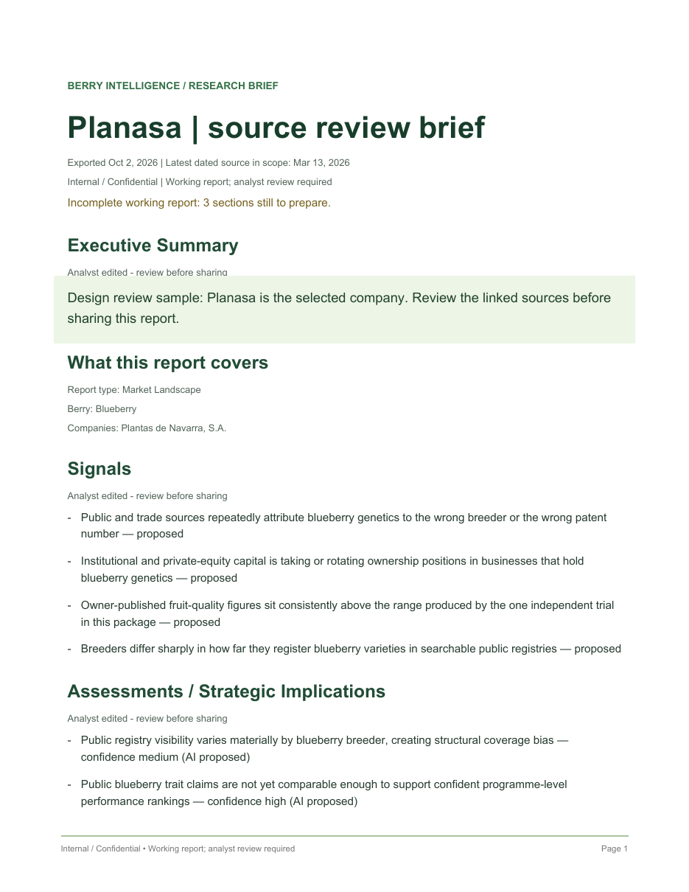
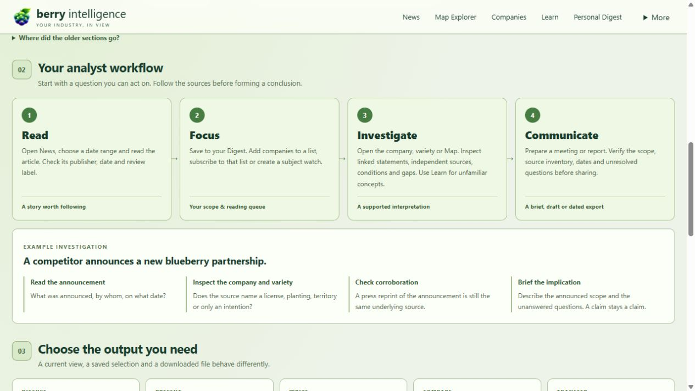
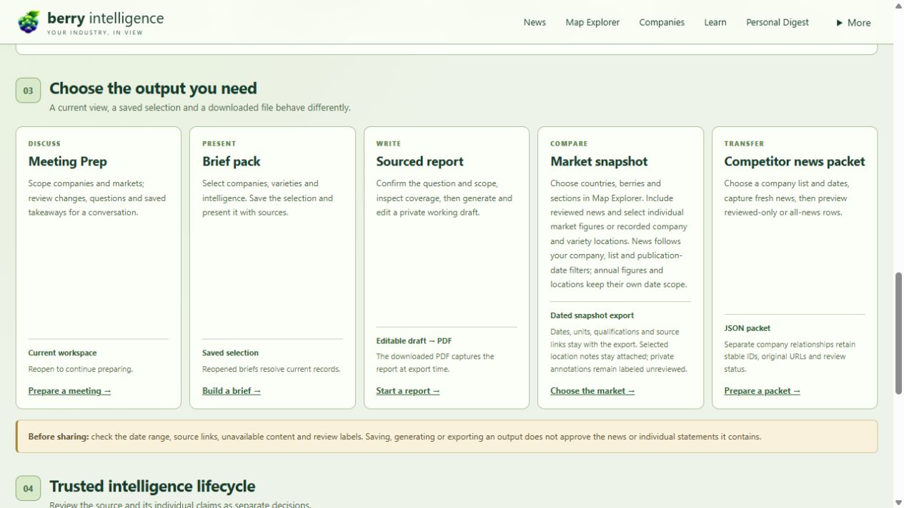
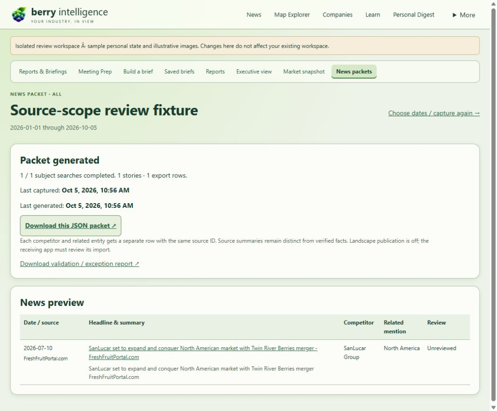

# Berry Intelligence release review

The approved redesign and consolidation is implemented in one canonical-base draft: [PR #312](https://github.com/samsonFive/berry-intelligence-os/pull/312). This is the release for review before merge or deployment. Production has not been changed. The final PR head must have all four required checks green; the PR records the exact final head and run without a self-referential documentation commit.

## What to review

Start with News and its right-side Reader, then Companies, Map Explorer and Personal Digest. The agricultural Glasshouse shell, contained More menu and shared marks/lists are the accepted direction. Review the takeaway-first report below and open **How it works** in More for the visual section/workflow/reporting guide. This is a working report sample, not a verified market conclusion.

## Final acceptance added October 5

A real one-company SanLucar watchlist capture used public Google News RSS, with January 1 through October 5 selected in the native form. The initial local-network restriction produced a failed capture and no export. After restarting only the isolated server with permitted network access, both independent captures completed: 17 discovered results, three qualifying hits before date/match selection. All-news produced one unreviewed export row; Reviewed-only produced zero. Empty reviewed coverage was not filled with a fresh unreviewed source.

The actual browser downloaded both JSON packets; schema validation passed. All-news recorded `2026-10-05T17:56:32Z`; Reviewed-only recorded `2026-10-05T17:57:47Z`. Re-download retained the first receipt. Last generated showed the later successful export. All seven packet history/job/capture files remained byte-identical after the isolated server restarted, and the native history still showed both exports. No source, statement or identity was approved. Original Google wrapper URLs stayed unchanged; Landscape publication stayed false. This one-subject probe proves the adapter/workflow, not comprehensive capture of all 77 competitors.

United States + Blueberry + the same list retained scope between Map, News and snapshot. The company-region table correctly had no records for that selected company; news mentions did not create operating regions. The native snapshot PDF retained **761 million lb** utilized production and **104,700 acres** harvested area for cultivated blueberries, 2025, with USDA page 75 and May 1 publication date. Both rendered pages were inspected. Its zero selected trusted-news count stays explicit. [Scoped snapshot sample](../../artifacts/design-sprint/release-snapshot-native.pdf).

Map and snapshot phone pages measured 375px inside a 390px viewport; the temporary override was reset. Packet columns now reserve readable source/review space, with wide content scrolling inside the phone table rather than widening the page. [Map phone](../../artifacts/design-sprint/release-map-phone.png) · [Snapshot phone](../../artifacts/design-sprint/release-snapshot-phone.png).

## Accepted-requirement audit

Every accepted requirement is accounted for below. Evidence distinguishes native actions, deterministic regressions, actual public captures and human-owned decisions. Existing mission reports retain earlier failures and their corrections; historical “remaining” notes are superseded by this final audit only for the named delivered work. The suite paths below exist in the current candidate and are included in required full CI.

| ID | Delivered purpose | Evidence and regression suite | Acceptance / limit |
| --- | --- | --- | --- |
| UI-01 | Agricultural Glasshouse identity and first berry icon | [MISSION-35-RETAINED-WORKSPACE-SHELL](MISSION-35-RETAINED-WORKSPACE-SHELL.md); [regressions](../../tests/test_retained_workspace_shell.py) | Desktop/phone shell evidence in M21/35; current guide and Map screenshots. |
| UI-02 | Full-width navigation and contained grouped More menu | [MISSION-35-RETAINED-WORKSPACE-SHELL](MISSION-35-RETAINED-WORKSPACE-SHELL.md); [regressions](../../tests/test_retained_workspace_shell.py) | Eleven consolidated homes; compatibility and specialist links retained. |
| UI-03 | Headline, lead, body and secondary-context hierarchy | [REPORT-READING-DESIGN-FOLLOWUP](REPORT-READING-DESIGN-FOLLOWUP.md); [regressions](../../tests/test_report_export_readability.py) | Five report PDF pages inspected; source/analyst wording preserved. |
| NEWS-01 | Newest-first, images, dates and multi-select filters | [MISSION-31-COMPACT-NEWS-AND-CAPTURE-BOUNDS](MISSION-31-COMPACT-NEWS-AND-CAPTURE-BOUNDS.md); [regressions](../../tests/test_news_workspace.py) | M29-31 source/date/phone acceptance; M37 conservative company recall. |
| NEWS-02 | Trusted/raw lanes and accessible feedback/save/source actions | [MISSION-03-NEWS-READER](MISSION-03-NEWS-READER.md); [regressions](../../tests/test_feed_first_acceptance.py) | Source review remains distinct from feedback and individual statements. |
| NEWS-03 | Overlay Reader, original content and publisher handoff | [MISSION-30-READER-PREVIEW-CONTINUITY](MISSION-30-READER-PREVIEW-CONTINUITY.md); [regressions](../../tests/test_feed_first_reader.py) | One real article: nine readable paragraphs/eight image references; unavailable content is explicit. |
| DIGEST-01 | Saved, reading queue and subscribed lists | [MISSION-37-CONSOLIDATION-RELEASE-AUDIT](MISSION-37-CONSOLIDATION-RELEASE-AUDIT.md); [regressions](../../tests/test_personal_digest.py) | Five real SanLucar source mentions matched News/Digest; shared personal state survived container restart/recovery. |
| CO-01 | Alphabet, favorites, independent tiers and lists | [MISSION-18-COMPANY-TRACKING-ACCEPTANCE](MISSION-18-COMPANY-TRACKING-ACCEPTANCE.md); [regressions](../../tests/test_company_directory.py) | Cross-view scope tests plus authenticated persisted favorite/tier/list. |
| CO-02 | Editable logo/links and company-only People | [MISSION-38-RELEASE-REHEARSAL](MISSION-38-RELEASE-REHEARSAL.md); [regressions](../../tests/test_company_profile_research.py) | Native chooser/upload/save/reset; protected individual research and edit/history tests. |
| VAR-01 | Supplied photo varieties associated with supplied companies | [MISSION-06-VARIETIES](MISSION-06-VARIETIES.md); [regressions](../../tests/test_operator_variety_seed.py) | 143 candidates/144 associations/32 unclear cells retained. Human identity/role decisions stay open. |
| VAR-02 | Growing/operating regions with source-assisted edits | [MISSION-27-SOURCE-LOCATION-SUGGESTIONS](MISSION-27-SOURCE-LOCATION-SUGGESTIONS.md); [regressions](../../tests/test_region_source_research.py) | Native isolated corrected company/variety locations reached shared Map; no inferred footprints. |
| MAP-01 | Country boundaries, shared scope and alphabetic region tables | [MISSION-29-SNAPSHOT-NEWS-SCOPE](MISSION-29-SNAPSHOT-NEWS-SCOPE.md); [regressions](../../tests/test_global_explorer.py) | Current native United States/Blueberry/list scope retained into News/snapshot; phone page 375px in 390px viewport. |
| MAP-02 | Sourced statistics and explicit research population | [MISSION-36-MARKET-REFERENCE-RESEARCH](MISSION-36-MARKET-REFERENCE-RESEARCH.md); [regressions](../../tests/test_market_reference_research.py) | USDA/Eurostat units and flags; real national research remains unapplied; current native/PDF original units checked. |
| PACK-01 | 77 supplied subjects, versioned schema and separate rows | [MISSION-02-COMPETITOR-NEWS-PACKETS](MISSION-02-COMPETITOR-NEWS-PACKETS.md); [regressions](../../tests/test_competitor_news_packets.py) | Real database identity test and unchanged-URL/separate-relationship-row regression; provisional identities disclosed. |
| PACK-02 | Reviewed-only/all, dates and successful export history | [MISSION-38-RELEASE-REHEARSAL](MISSION-38-RELEASE-REHEARSAL.md); [regressions](../../tests/test_competitor_news_packets.py) | Current native real capture: All=1 row, Reviewed=0; both schema-valid downloads/receipt times; seven persisted files byte-identical after restart. |
| PACK-03 | Fresh capture before generation; real failure and retry | [MISSION-38-RELEASE-REHEARSAL](MISSION-38-RELEASE-REHEARSAL.md); [regressions](../../tests/test_competitor_news_packets.py) | Actual blocked capture refused export; permitted retry found 17 hits; freshness/schema/idempotency failures tested. |
| AUDIT-01 | Purpose, working state, consolidation and retained workflows | [APP-SECTION-AUDIT](APP-SECTION-AUDIT.md); [regressions](../../tests/test_retained_workspace_shell.py) | Accepted eleven-home structure, retained routes; M37 audited ten historical PRs including all 868 paths in #253. |
| REPORT-01 | One home with distinct report/brief/snapshot/packet outputs | [MISSION-07-REPORTS-BRIEFINGS](MISSION-07-REPORTS-BRIEFINGS.md); [regressions](../../tests/test_briefings_workspace.py) | Native brief save/reopen/duplicate/presentation and edited report/PDF, plus current native snapshot/packet. |
| REPORT-02 | Meeting Prep scope, takeaways and handoffs | [MISSION-07-REPORTS-BRIEFINGS](MISSION-07-REPORTS-BRIEFINGS.md); [regressions](../../tests/test_briefings_workspace.py) | Native scoped takeaway persistence and handoff; deliberate research only; pure reads/error guards tested. |
| REPORT-03 | Takeaway-first designed reports with readable references | [REPORT-READING-DESIGN-FOLLOWUP](REPORT-READING-DESIGN-FOLLOWUP.md); [regressions](../../tests/test_report_export_readability.py) | Original critique corrected: numbered findings, plain source references, all five PDF pages and phone inspected. |
| LAND-01 | Customizable competitive Landscape | [MISSION-08-CUSTOMIZABLE-LANDSCAPE](MISSION-08-CUSTOMIZABLE-LANDSCAPE.md); [regressions](../../tests/test_landscape_workspace.py) | Saved private what/where/date/section scope, handoffs and read-only/provider boundaries tested/reviewed. |
| LEARN-01 | Top-level detailed visual Learn | [MISSION-19-LEARN-TEACHING-VISUALS](MISSION-19-LEARN-TEACHING-VISUALS.md); [regressions](../../tests/test_learn_teaching_visuals.py) | Five-pillar teaching diagrams, licensed image and source/video links; knowledge classes retained. |
| LEARN-02 | Selection to explicit deep research and editable lesson | [MISSION-09-VISUAL-LEARN](MISSION-09-VISUAL-LEARN.md); [regressions](../../tests/test_learn_research.py) | One actual 42-source research; native existing-lesson detour/save/reload; durable uncertain-run recovery without resubmission. |
| INT-01 | Plain-language investigation and retained human decisions | [MISSION-17-INTELLIGENCE-AUTHORING](MISSION-17-INTELLIGENCE-AUTHORING.md); [regressions](../../tests/test_intelligence_authoring_workspace.py) | M12-17/34/35 native review/authoring/history; original passages and per-proposition gates retained. |
| MON-01 | Watches, changes, alerts and monitoring plans together | [MISSION-10-MONITOR-OPERATIONS](MISSION-10-MONITOR-OPERATIONS.md); [regressions](../../tests/test_monitor_consolidation.py) | Native read/reopen, dismiss/reopen, pause/reload/resume; durable history/corruption and origin tests. |
| OPS-01 | Collection, review, data quality and coverage together | [MISSION-34-SOURCE-AUTHENTICITY-WORKSPACE](MISSION-34-SOURCE-AUTHENTICITY-WORKSPACE.md); [regressions](../../tests/test_review_operations.py) | Native separate fidelity gate/refusal/advance/history; no collection on browse; retained specialists. |
| GUIDE-01 | Visual section/workflow/reporting explainer | [MISSION-38-RELEASE-REHEARSAL](MISSION-38-RELEASE-REHEARSAL.md); [regressions](../../tests/test_guided_analyst_experience_v1.py) | Current desktop and phone: eleven purpose cards, four steps, worked example, five outputs and separate review lifecycle. |
| REL-01 | Canonical reconciliation, tested release and safe recovery | [MISSION-38-RELEASE-REHEARSAL](MISSION-38-RELEASE-REHEARSAL.md); [regressions](../../tests/test_runtime_backup.py) | Authenticated isolated exact-head container, 2,798-file verified restore/prior-image rollback, unchanged production; final PR checks required. |

Final focused packet, Briefings and Guide checks: **48 passed**, one existing ReportLab warning, 15.30 seconds.

## Deliberate limits and human decisions

- Photo spelling/identity/company-role exceptions and ambiguous source identities remain review items. The import seeds candidates; it does not assert ownership or merge uncertain identities.
- Publisher access, article text, images and national statistics remain source-dependent. Existing missing values/annual qualifications stay visible; more coverage and licensed lesson media are ongoing content work, not invented data.
- Research results are cited editable proposals. Publication, individual statement, source authenticity, market-figure acceptance and extraction qualification are separate human decisions. Feedback, saving, subscriptions and report generation do not perform them.
- The supported deployment is one shared analyst workspace with one application worker. Separate user-account state, distributed writers and exact subnational polygons are later scope. Provider configuration/readiness is checked without enabling recurring collection/extraction or copying keys into review artifacts.
- Original private user edits/history and existing runtime records are preserved. No historical draft PR was merged, closed or applied wholesale. Canonical expansion-guide content remains verbatim.

## Release and rollback readiness

Required checks passed on application/package head `60d6f0f8208db3b39d1ac9c7ca8322bbea87bffe`: 3,895 passed / 11 skipped / two existing warnings, run [37349791854](https://github.com/samsonFive/berry-intelligence-os/actions/runs/37349791854). This final acceptance update also changes packet presentation, so its pushed head requires fresh checks. The PR must show successful **Change scope**, **Repository integrity**, **Static public safety** and **Python tests** before approval.

The prior exact committed 3,471-file package ran as a separate authenticated, loopback-only container on the existing trusted host. Twelve core routes loaded. Favorite/tier/list and an edited existing company record survived restart. A verified 2,798-file backup restored byte-for-byte into a new empty target; the previous production image ran against an isolated restored copy. Live container ID/image/start/mounts stayed unchanged. The final candidate is packaged with committed-byte/executable-mode verification; final identity, hash, container smoke and CI are recorded in PR #312 after push. See [rehearsal and deployment sequence](MISSION-38-RELEASE-REHEARSAL.md).

After final human approval, deployment must first verify a fresh consistent backup of the actual production data/inbox and record its previous image/configuration. Keep the existing authenticated persistent mounts and one worker; deploy code without replacing user data. Verify login, core workflows and selected operator state. Revert the image on an application regression; restore data only for an actual data regression under the documented safe recovery procedure. The test backup does not replace a production backup.

No additional user interview is needed to review this candidate. Merge and live deployment remain the explicit final approval boundary.
