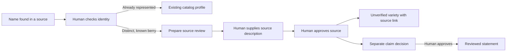

# From discovered variety name to catalog review

A discovered name now has a visible next step after human identity review:
**Prepare catalog review**. The existing intake and publication review process
can add an **unverified** variety with a supporting source. A separate explicit
claim decision is still necessary for trusted factual statements. This closes
the missing navigation handoff, not global catalog coverage.

## What changes

- Candidate review preserves filters, the selected candidate, notes and reviewer.
  An explicit reviewer field also works in a local workspace without a login.
- Reviewed distinct names show **Prepare catalog review**. Exact existing name
  or alias matches link the existing profile; ambiguous matches require identity
  resolution. No second matching policy or fuzzy automatic identity merge.
- Preparation carries the reviewed name, berry and original public source URL.
  Primary product links are preferred when recorded. Summary and publication
  date remain blank for human input; checked dates are never publication dates.
- Saving preparation opens the existing source review form. Its publication
  role uses the existing `ReviewPublishService`, repository transaction and
  second claim-review path; no new catalog writer or entity/domain schema.
- Intake and publication recheck the current identity decision and current
  catalog. A changed decision, existing name/alias, wrong berry/name or private
  URL blocks publication before writes. Same-origin checks cover this handoff.
- Source review does not invent aliases, breeder/owner roles, rights, traits,
  images or locations. Candidate provenance and identity notes remain in the
  private candidate file; preparation metadata is not copied into Evidence.
- Claim review now displays its required reviewer inputs rather than hiding
  empty values. The existing approve/reject semantics remain unchanged.

The legacy advanced review already supported human-supplied names becoming
unverified entities. The gap described in the preceding diagnostic was a
**concrete reviewed handoff**, not a complete absence of authoring capability.
The newer publication-command path still links existing entities only and is
unchanged. This work does not bypass either workflow's trust semantics.

## Acceptance evidence

Fictional isolated acceptance checks cover identity → intake → source approval
→ unverified source-linked entity → separate claim approval. Source approval
alone produces no Fact or Relationship. Claim approval does not change the
entity's unverified identity status. Candidate bytes and original query-bearing
URLs survive unchanged; private decision notes and candidate IDs do not enter
published Evidence. Missing reviewer, rejected/stale decisions, changed scope,
name/alias collisions, ambiguous aliases, unsafe URLs, cross-origin requests
and read-only mode are exercised before writes.

Actual browser review on localhost used only explicitly fictional fixtures in
`inbox/catalog-handoff/runtime`, copied from the branch's data snapshot. It
performed the complete flow and checked the profile's Unverified status, linked
source and absent company roles. A second synthetic identity fixture tested
390-pixel preparation containment and keyboard disclosure. No real candidate
was marked reviewed or published. Canonical `data/` and operator inboxes were
not edited. Ignored screenshots are in `inbox/catalog-handoff/`.

194 related intake/review/candidate/navigation tests passed with 145 existing
dependency warnings in 89.60 seconds before the browser usability fixes.
52 focused follow-up checks passed with one existing ReportLab warning in
21.37 seconds. Final acceptance and exact-head CI results belong in the draft
PR description; do not substitute an earlier run for the final commit.

## Still required for comprehensive coverage

The real baseline remains **64 existing catalog entries**, not 64 approved
varieties; 57 active, six unverified and one historical. Primary checks retain
381 name occurrences / 25 exact catalog matches / 356 occurrence review needs,
and 341 combined candidate keys before private state. These denominators differ.
The fictional preview's extra entry is not a coverage gain.

CAT-01/CAT-02 and TD-116 stay open: 62 registry rows still need primary checks;
table, Spanish, Polish and body-only discovery misses remain in the diagnostic;
historic/public-domain varieties, rights/alias checks, dated provenance, cited
traits/images/growing regions and refresh acceptance remain. Independent human
recall scoring and external comparison are prerequisites to any web-leading
claim. Human identity/source/claim review remains required. Landscape remains
at the blueberry checkpoint; no merge, deployment or other-berry rollout.

Final focused follow-up: 56 passed / one existing warning in 22.13 seconds; the subsequent strict human-gate check passed all 23 handoff cases / one warning in 3.90 seconds. Record validation and diff whitespace checks passed. Canonical data, schemas and governing expansion guide are unchanged.
